# QR Lab

[](CHANGELOG.md)
[](https://laravel.com)
[](https://vuejs.org)
[](https://tailwindcss.com)
[](https://opensource.org/licenses/MIT)

A self-hosted QR code platform built with Laravel and Vue.js. Generate styled QR codes of many types, track scans with geolocation analytics, manage users with invite-only access, and monitor platform usage from a global super-admin dashboard.

> **Disclaimer:** This software is provided "as is", without warranty of any kind. Use at your own risk. The authors are not responsible for any data loss, security breaches, or other damages resulting from the use of this software. Always review the code and configure proper security measures before deploying to production.

## Screenshots

### QR generator & dashboard

<p align="center">
  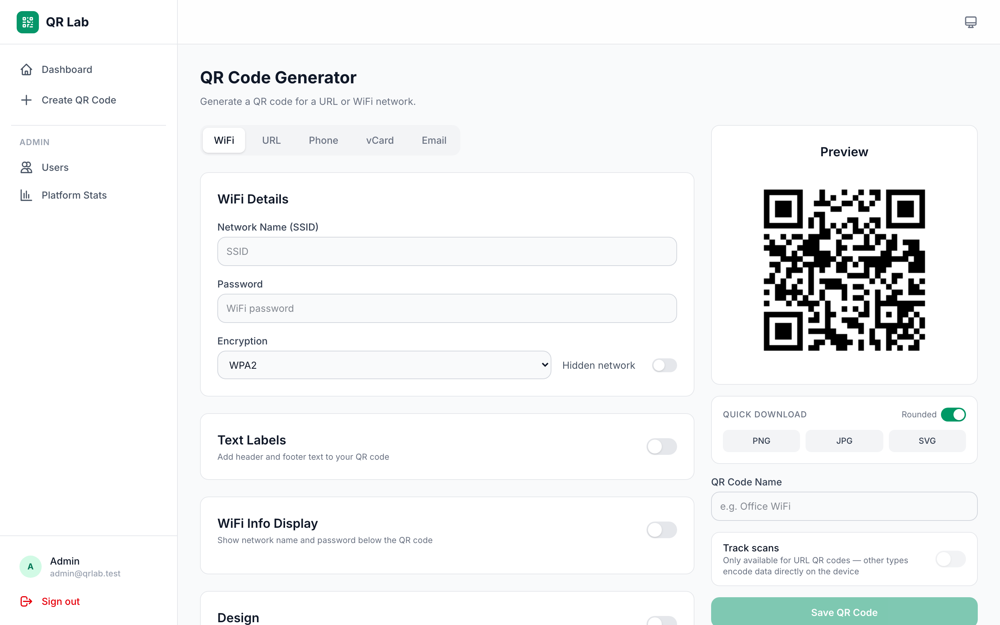
  &nbsp;
  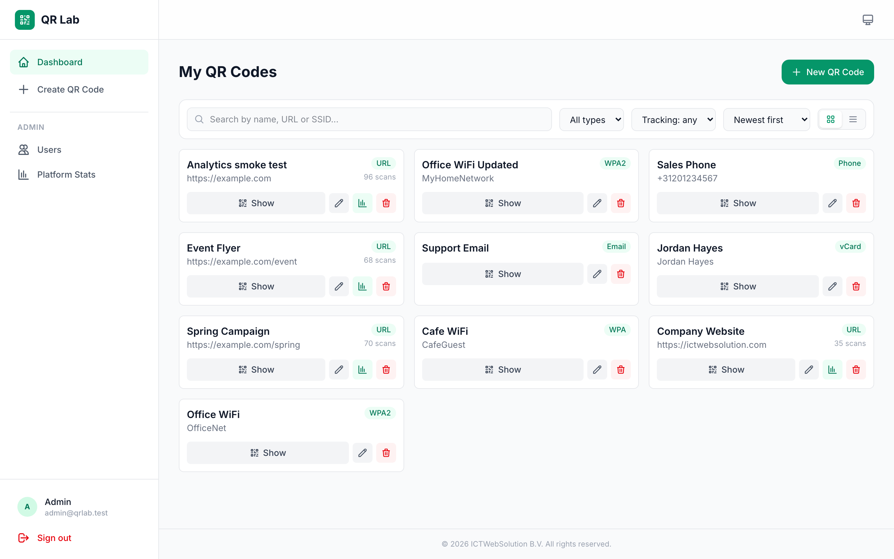
</p>

<p align="center">
  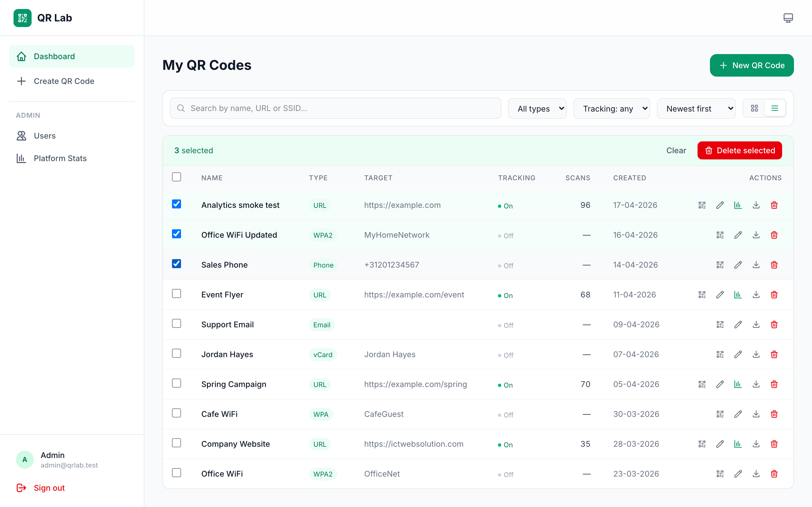
  &nbsp;
  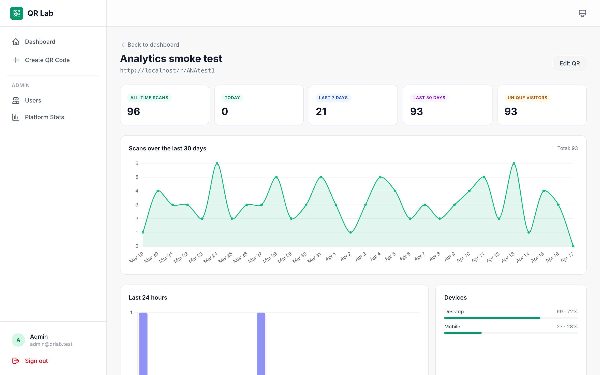
</p>

### Bulk import & batches

<p align="center">
  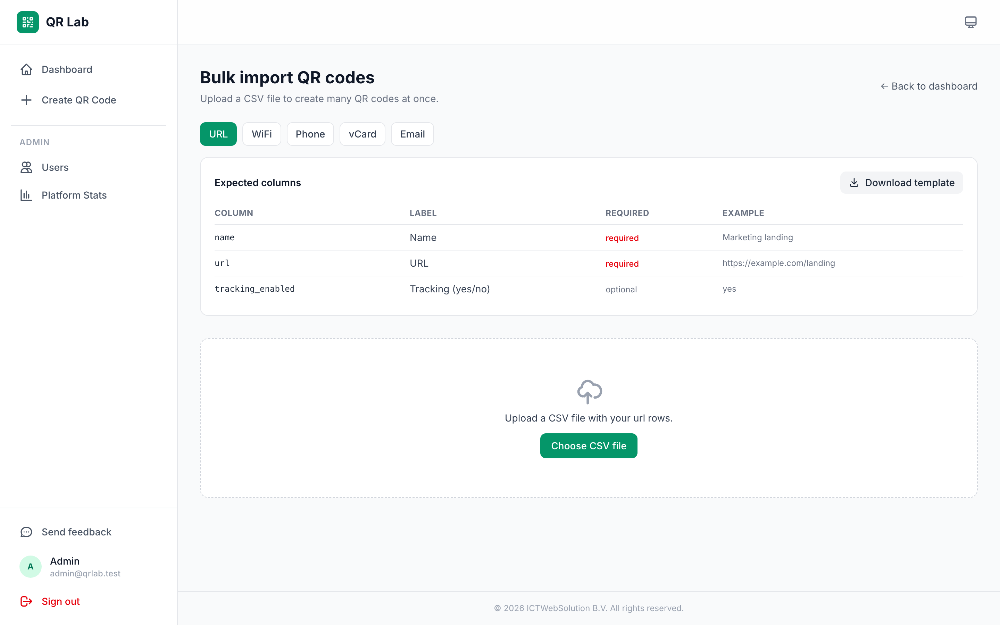
  &nbsp;
  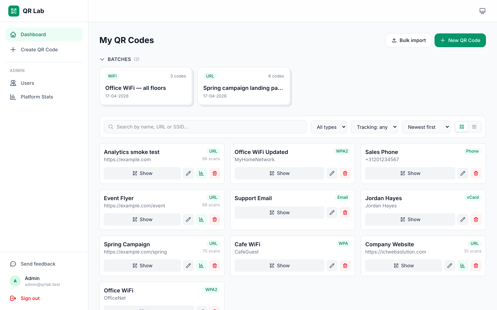
</p>

<p align="center">
  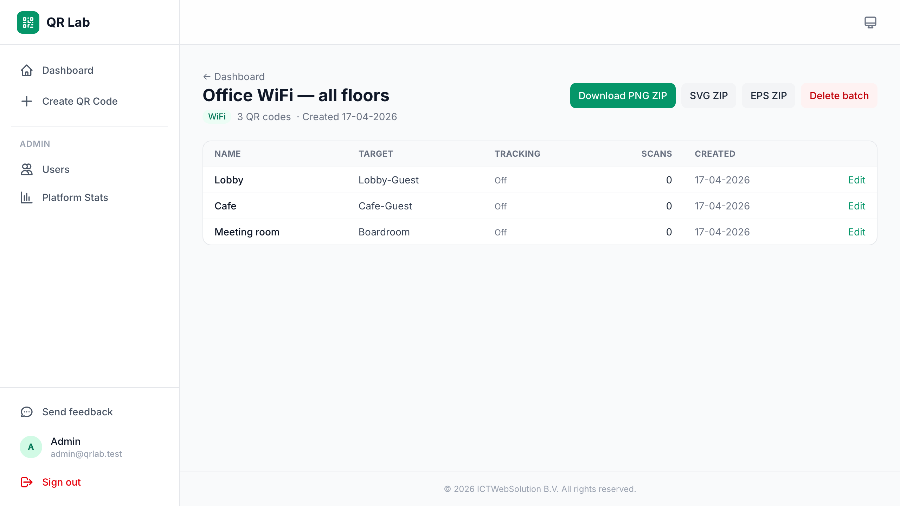
</p>

### Administration

<p align="center">
  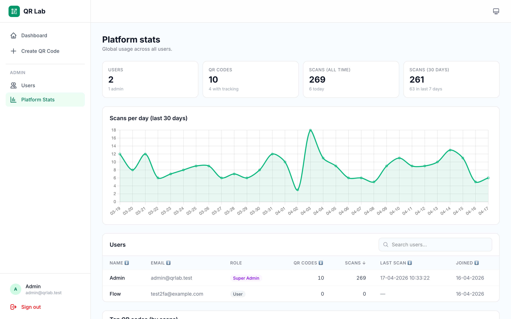
  &nbsp;
  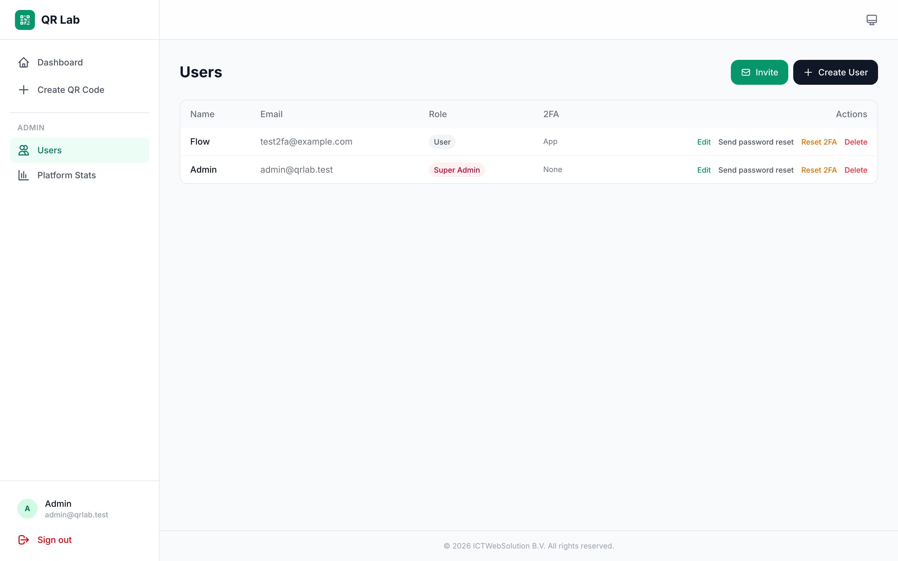
</p>

### Profile & authentication

<p align="center">
  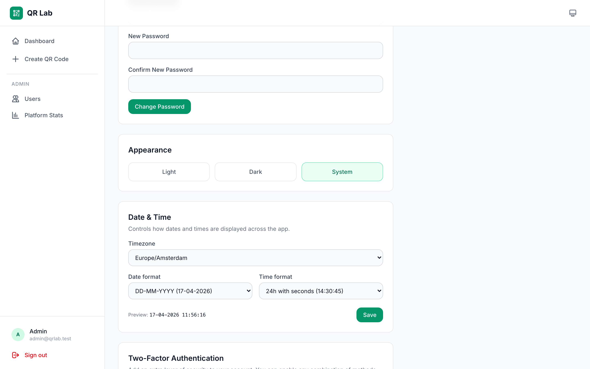
  &nbsp;
  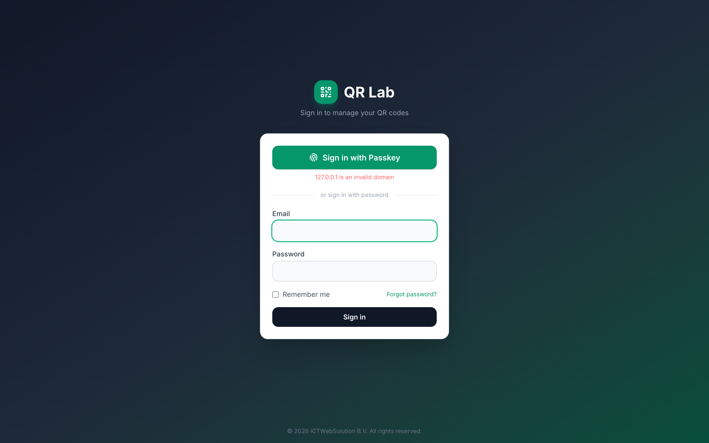
</p>

## Features

### QR code generation
- **Multiple QR types** — WiFi, URL, Phone, Email (mailto:), and vCard contact cards.
- **Live preview** — Instant client-side preview that updates as you type, powered by qr-code-styling.
- **Custom styling** — Dot styles (square, dots, rounded, classy), corner styles, foreground/background colors, and error correction levels.
- **Logo embedding** — Upload a logo per QR code (stored privately and served through an authenticated route). Logos are automatically cleaned up when a QR code is deleted.
- **Text labels** — Add header and footer text with fonts, markup, and custom per-side margins.
- **Font picker** — Choose from bundled web fonts for label text.
- **WiFi info display** — Optional credential panel rendered below WiFi QR codes.
- **Multiple export formats** — PNG, JPG, and SVG from the browser; PNG, SVG, and EPS from the server.
- **URL smart-save** — Schemeless URLs automatically prepended with `https://`.

### Scan tracking & analytics
- **Short-link redirects** — Every URL/trackable QR code gets a short tracking URL (`/r/{code}`).
- **Per-QR analytics dashboard** — Timeline chart, totals, top referrers, and device/country breakdowns.
- **Location tracking** — Optional IP-based geolocation captured per scan.
- **Opt-in tracking toggle** — Always visible; disabled for non-trackable types like WiFi/vCard.
- **Global platform stats** — Super admins see network-wide totals, 30-day trend, top QR codes, and per-user usage.

### Dashboard & organization
- **Grid & list views** — Toggle between fluid card grid and compact table; choice persisted locally.
- **Filters** — Search, filter by type and tracking state, sortable columns.
- **Bulk actions** — Select multiple QR codes in list view and delete in one action.
- **Fluid card layout** — Auto-fill grid scales smoothly from 4 → 3 → 2 → 1 columns.
- **Show QR modal** — Preview any saved QR code without leaving the dashboard.
- **Batches** — Imported sets show as distinct "bulk" cards with stacked styling. The section is collapsed by default and auto-expands once when a new batch appears, then collapses again on the next visit.

### Bulk import
- **CSV import for all 5 QR types** — URL, WiFi, Phone, vCard, Email.
- **Downloadable templates** — One-click per-type CSV template with headers + example row so users know the exact columns.
- **Validate & preview** — Upload, see the first 5 rows and per-row errors, then confirm the import. No re-upload on confirm (the preview is stashed server-side).
- **Batch view** — Every import lands in its own batch page listing every created QR code with scan counts and edit links.
- **ZIP export** — Download all QR codes in a batch as a single ZIP in PNG, SVG, or EPS. Files are named after each QR code (slugified) with duplicate-safe suffixes.

### Accounts & authentication
- **Invite-only access** — No public registration. Admins invite users via secure, single-use invite links (HTML email included).
- **Two-step signup wizard** — Invited users set credentials then immediately enroll in 2FA.
- **Mandatory two-factor authentication** — Supports TOTP authenticator apps, email codes, and WebAuthn passkeys (Face ID / Touch ID / Windows Hello). At least one method is required.
- **Skip 2FA in local dev** — Set `TWO_FACTOR_ENABLED=false` in `.env` for local iteration. Defaults to enforced in any non-local environment.
- **Password reset** — Standard email-based reset, plus admin-initiated reset links.
- **Admin-initiated 2FA reset** — Force a user to re-enroll on next sign-in.

### User roles
- **Three-tier role model** — `user`, `admin`, `super_admin`.
- **Admins** — Manage users, send invites, reset passwords, reset 2FA.
- **Super admins** — All admin capabilities plus platform-wide stats dashboard and the ability to grant/revoke the `super_admin` role. Regular admins cannot delete or demote super admins.
- **Artisan promotion** — `php artisan user:promote <email> <user|admin|super_admin>`.

### Profile & preferences
- **Theme** — Light, dark, or auto (follows system). Persisted per user.
- **Timezone** — Choose from 24 common IANA zones; defaults to `Europe/Amsterdam`.
- **Date/time format** — Configurable date format (DD-MM-YYYY, MM/DD/YYYY, etc.) and 24h/12h time with seconds. Shared `Intl.DateTimeFormat`-based formatter is used across the app.
- **Passkey management** — Register and revoke passkeys from the profile page.

### Feedback
- **In-app feedback widget** — "Send feedback" button in the sidebar opens a modal with optional name/email, a message, and up to 5 screenshot uploads. Submissions are emailed to the address set via `FEEDBACK_EMAIL` (falls back to `MAIL_FROM_ADDRESS`). Reply-to is set to the submitter when provided.

### UI / UX
- **Light & dark mode** — Full coverage across every page.
- **Responsive design** — Sidebar navigation on desktop, bottom tab bar on mobile.
- **Flash toasts** — Non-blocking success/error notifications.
- **Styled invite email** — Matches app branding (dark background, logo, dark CTA button).

## Tech Stack

- **Backend**: Laravel 13, PHP 8.3+
- **Frontend**: Vue 3, Inertia.js v3, Tailwind CSS 4
- **QR Generation**: qr-code-styling (client-side), endroid/qr-code v6 (server-side)
- **Charts**: Chart.js + vue-chartjs
- **Authentication**: spatie/laravel-passkeys (WebAuthn), TOTP, email OTP
- **Database**: MySQL / PostgreSQL / SQLite

## Installation

### Requirements

- PHP 8.3+
- Composer
- Node.js 18+
- MySQL 8.0+ / PostgreSQL 14+ / SQLite

### Local Development

```bash
# Clone the repository
git clone https://github.com/ICTWebSolutionBV/qrlab.git
cd qrlab

# Install PHP dependencies
composer install

# Install Node dependencies
npm install

# Copy environment file and generate key
cp .env.example .env
php artisan key:generate

# Configure your database in .env
# For SQLite (default):
touch database/database.sqlite

# For MySQL:
# DB_CONNECTION=mysql
# DB_HOST=127.0.0.1
# DB_PORT=3306
# DB_DATABASE=qrlab
# DB_USERNAME=root
# DB_PASSWORD=

# Optional: skip 2FA enforcement locally
# TWO_FACTOR_ENABLED=false

# Run migrations and seed admin user
php artisan migrate --seed

# Build frontend assets
npm run build

# Start development servers
php artisan serve
npm run dev
```

The default admin account is `admin@qrlab.test` / `password`. Change the password after first login.

### Promoting a super admin

```bash
php artisan user:promote you@example.com super_admin
```

The super admin gets a **Platform Stats** link in the sidebar and can grant the super-admin role to other users from the Admin → Users page.

## Deploying with Ploi

### 1. Create a New Site

- In Ploi, create a new site pointing to your domain
- Set the web directory to `/public`
- Select PHP 8.3+ as the PHP version

### 2. Connect Repository

- Go to your site's **Repository** tab
- Connect to `github.com/ICTWebSolutionBV/qrlab`
- Set branch to `main`
- Enable **Install Composer dependencies**

### 3. Deploy Script

Replace the default deploy script with:

```bash
cd {SITE_DIRECTORY}
git pull origin main

composer install --no-interaction --prefer-dist --optimize-autoloader --no-dev

npm ci
npm run build

php artisan migrate --force
php artisan config:cache
php artisan route:cache
php artisan view:cache
php artisan storage:link

echo "Application deployed!"
```

### 4. Environment Variables

In the **Environment** tab, update your `.env`:

```env
APP_NAME="QR Lab"
APP_ENV=production
APP_DEBUG=false
APP_URL=https://your-domain.com

DB_CONNECTION=mysql
DB_HOST=127.0.0.1
DB_PORT=3306
DB_DATABASE=qrlab
DB_USERNAME=your_db_user
DB_PASSWORD=your_db_password

# Leave unset (or true) in production to enforce 2FA
# TWO_FACTOR_ENABLED=true
```

### 5. Run Migrations & Seed Admin

SSH into your server (or use Ploi's **Terminal**) and run:

```bash
cd {SITE_DIRECTORY}
php artisan migrate --seed
```

This creates the default admin user (`admin@qrlab.test` / `password`). Change the credentials after first login, and promote yourself to `super_admin` if desired:

```bash
php artisan user:promote you@example.com super_admin
```

### 6. SSL

Enable **Let's Encrypt** SSL in Ploi's **SSL** tab for your domain.

### 7. Storage Link

If not already created by the deploy script:

```bash
cd {SITE_DIRECTORY}
php artisan storage:link
```

## Versioning

QR Lab follows [Semantic Versioning](https://semver.org/). The current release is **v1.0.0**. Subsequent changes are published as `v1.x.x` tags and tracked in [CHANGELOG.md](CHANGELOG.md):

- **Patch (`1.0.x`)** — Bug fixes and small tweaks.
- **Minor (`1.x.0`)** — New features, backwards-compatible.
- **Major (`x.0.0`)** — Breaking changes.

## License

This project is licensed under the MIT License - see the [LICENSE](LICENSE) file for details.

**USE AT YOUR OWN RISK.** The authors assume no liability for any damages or issues arising from the use of this software.
